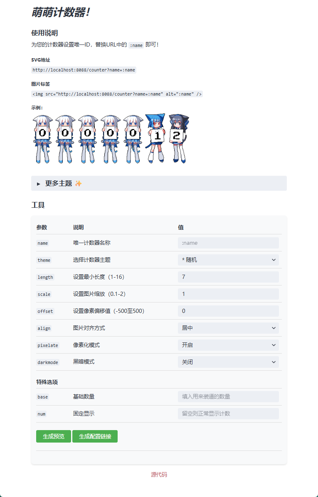

# MoeCounter - 萌萌计数器

<div align="center">
  
<p style="font-size: 18px; color: #555; margin-top: 20px; line-height: 1.6; font-weight: 500;">
    基于Go语言的模块化计数器服务，采用清晰的分层架构设计（路由层/控制层/数据层），提供灵活的API接口。支持SVG计数图片生成，内置数十种主题，可通过参数定制显示效果。
  </p>
</div>

## 项目架构

```
.
├── cmd/               # 命令行入口
│   ├── root.go        # 根命令
│   └── start.go       # 启动命令
├── internal/          # 内部包
│   ├── database/      # 数据库模块
│   │   └── sqlite3.go
│   └── utils/         # 工具函数
│       └── combine.go
├── public/            # 前端资源
│   ├── assets/        # 静态资源
│   │   └── theme/     # 主题资源目录
│   ├── favicon.ico    # 站点ico图标
│   └── index.html     # 首页
├── server/            # 服务端
│   ├── controller/    # 控制器
│   │   ├── common.go  # 公共定义
│   │   ├── counter.go # 计数器逻辑
│   │   └── theme.go   # 主题逻辑
│   └── router.go      # 路由定义
├── go.mod             # Go模块定义
├── go.sum             # 依赖校验
└── main.go            # 程序入口
```

## 运行逻辑

1. **初始化**：
   - 解析命令行参数（端口、数据库文件）
   - 初始化SQLite数据库
   - 加载嵌入式静态资源

2. **请求处理**：
   - `/`：返回首页HTML
   - `/assets/*`：提供静态资源
   - `/api/counter`：处理计数器请求
   - `/api/themes`：获取可用主题列表

3. **计数逻辑**：
   - 根据`name`参数获取或创建计数器
   - 增加计数值（除非指定`num`参数）
   - 应用`base`偏移量
   - 生成SVG图片响应

## 安装与运行

### 前置要求
- Go 1.16+

### 编译运行命令
```bash
# 编译项目
go build -o moeCounter

# 启动服务（默认端口8088，数据库data.db）
./moeCounter start

# 自定义参数
./moeCounter start -p 8080 -d custom.db

# 注意：不建议直接在终端直接运行
# 1Panel：创建守护进程
# 宝塔面板：Go项目 / 进程守护管理器
# 其他：使用nohup命令或者手动创建服务
```

### 命令行参数
| 参数 | 缩写 | 默认值 | 描述 |
|------|------|---------|------|
| `--port` | `-p` | 8088 | 服务监听端口 |
| `--db` | `-d` | data.db | 数据库文件路径 |
| `--debug` | `无` | false | 是否开启调试模式 |

## API接口

### 计数器接口
`GET /api/counter?name=[计数器名称]&[参数]`

**参数说明**：
| 参数 | 类型 | 默认值 | 描述 |
|------|------|---------|------|
| `name` | string | 无 | 计数器名称（必需） |
| `theme` | string | 随机 | 主题名称 |
| `length` | int | 7 | 显示数字长度 |
| `scale` | float | 1.0 | 图片缩放比例 |
| `offset` | int | 0 | 数字间距 |
| `align` | string | left | 对齐方式（left/center/right） |
| `pixelate` | string | off | 像素化效果（on/off） |
| `darkmode` | string | off | 暗黑模式（on/off） |
| `base` | int | 无 | 基础计数值（添加到实际计数） |
| `num` | string | 无 | 直接指定计数值（不增加计数） |

**响应**：SVG格式图片（Content-Type: image/svg+xml）

### 主题列表接口
`GET /api/themes`

**响应**：
```json
{
  "themes": ["theme1", "theme2", "theme3"]
}
```

## 主题系统

主题位于`public/assets/theme`目录，每个主题是一个独立文件夹，包含0-9的数字图片（.png或.gif格式）。

内置主题包括：
- 3d-num
- asoul
- booru系列
- capoo
- miku
- minecraft
- 等数十种主题

## 示例

```bash
# 基本使用
http://localhost:8088/counter?name=test

# 自定义主题和样式
http://localhost:8088/counter?name=test&theme=miku&length=5&scale=0.8&align=center

# 直接指定计数值
http://localhost:8088/counter?name=test&num=12345
```

## 开发指南

### 添加新主题
1. 在`public/assets/theme`下创建新文件夹
2. 添加0-9的数字图片（支持.png/.gif）
3. 可选：添加`start`（前缀）和`end`（后缀）图片
4. 重启服务即可使用新主题

### 构建与部署
```bash
# 编译Linux可执行文件
GOOS=linux GOARCH=amd64 go build -trimpath --ldflags="-s -w" -o moeCounter

# 编译windows可执行文件
GOOS=windows GOARCH=amd64 go build -trimpath --ldflags="-s -w" -o moeCounter.exe

# 编译macos可执行文件
GOOS=darwin GOARCH=arm64 go build -trimpath --ldflags="-s -w" -o moeCounter
```

## GitHub Actions自动发布

我们提供了GitHub Actions自动化脚本，用于在推送标签时自动构建并发布Release。

**使用步骤**：
1. 将项目代码推送到GitHub仓库
2. 创建版本标签并推送到仓库：
   ```bash
   git tag v1.0.0  # 替换为你的版本号
   git push origin v1.0.0
   ```
3. 在GitHub仓库的"Releases"页面查看自动生成的发布版本

**工作流说明**：
- 触发条件：推送`v*.*.*`格式的标签
- 构建环境：多平台支持（Linux / macOS / Windows）
- 自动生成多平台二进制文件并打包
- 使用GitHub Token自动创建Release并上传所有构建产物
- Go版本：1.22

**权限配置**：
工作流需要以下权限：
1. **默认设置**：
   - GitHub 自动为每个工作流运行生成 `GITHUB_TOKEN`
   - 无需手动创建或配置
   - 权限范围：当前仓库的读写权限

2. **权限验证与设置**：
   - 访问仓库 `Settings > Actions > General`
   - 在 `Workflow permissions` 部分：
     - 选择 `Read and write permissions`
     - 确保 `Allow GitHub Actions to create and approve pull requests` 已勾选
   - 保存设置

3. **权限不足解决方案**：
   如果遇到 403 权限错误：
   ```bash
   # 1. 创建更高权限的Personal Access Token(PAT)：
   #    - 访问 https://github.com/settings/tokens
   #    - 点击 "Generate new token"
   #    - 权限范围勾选 "repo" (完整仓库控制)
   #    - 复制生成的Token值
   
   # 2. 在仓库Secrets中添加：
   #    - 访问仓库 Settings > Secrets > Actions
   #    - 点击 "New repository secret"
   #    - Name: RELEASE_TOKEN
   #    - Secret: [粘贴生成的Token]
   
   # 3. 在工作流中替换Token：
   env:
     GITHUB_TOKEN: ${{ secrets.RELEASE_TOKEN }}
   ```

4. **工作流权限检查**：
   - 每次工作流运行时，会自动使用 `GITHUB_TOKEN`
   - 权限级别可在工作流日志的 "Set up job" 部分查看
   - 如果看到 `Permission: write` 表示有足够权限

## 依赖
- Gin Web框架
- GORM ORM库
- Cobra命令行库

## 预览


## 感谢
本项目部分资源基于 [journey-ad/Moe-Counter](https://github.com/journey-ad/Moe-Counter) 开发

## Star History
<a href="https://star-history.com/?repos=skyle1995/Moe-Counter-Go&type=Date#skyle1995/Moe-Counter-Go&Date">
 <picture>
   <source media="(prefers-color-scheme: dark)" srcset="https://api.star-history.com/svg?repos=skyle1995/Moe-Counter-Go&type=Date&theme=dark" />
   <source media="(prefers-color-scheme: light)" srcset="https://api.star-history.com/svg?repos=skyle1995/Moe-Counter-Go&type=Date" />
   
 </picture>
</a>
